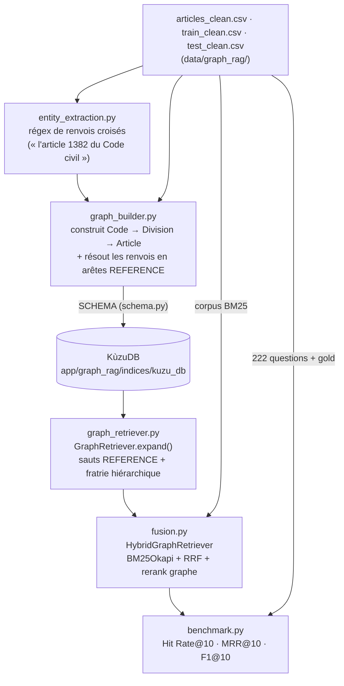

# GraphRAG sur BSARD — architecture et résultats de benchmark

**Module évalué :** `app/graph_rag`
**Corpus :** BSARD (Belgian Statutory Article Retrieval Dataset) — 22 382 articles, 34 codes belges
**Questions de test :** 222 (`data/graph_rag/test_clean.csv`)
**Top-K :** 10

---

## 01 — Le benchmark : BSARD

Le module `graph_rag` n'est pas évalué sur le corpus marocain (SGG/BO) mais sur **BSARD**, un benchmark belge de recherche d'articles de loi : 22 382 articles issus de 34 codes belges (Code civil, Code judiciaire, Code wallon de l'Action sociale et de la Santé, etc.), chacun rattaché à une hiérarchie structurée `book → part → act → chapter → section → subsection`, accompagné de 222 questions de test annotées avec les identifiants d'articles attendus (`article_ids`).

Ce choix est délibéré : contrairement au corpus SGG marocain, BSARD fournit déjà les entités (code, division, article) sous forme de colonnes structurées — pas besoin de NER. Cela permet de valider l'approche GraphRAG (exploitation des renvois croisés et de la hiérarchie juridique) sur un terrain propre, avant de l'appliquer au corpus marocain.

---

## 02 — Architecture end-to-end

### Rôle de chaque composant

| Fichier | Rôle |
|---|---|
| `schema.py` | Déclare le schéma KùzuDB : nœuds **Code**, **Division** (générique book→subsection), **Article** ; relations **CONTIENT_CD / CONTIENT_DD / CONTIENT_DA / CONTIENT_CA** (hiérarchie) et **REFERENCE** (renvoi croisé article→article). |
| `entity_extraction.py` | Détecte par regex les renvois croisés dans le texte brut des articles (`"articles 137 et 140 à 140septies"`) et produit des tuples `(source, code_cible, numéro_cible)` bruts, non encore résolus. |
| `graph_builder.py` | Construit la hiérarchie Code→Division→Article depuis les colonnes structurées du CSV, puis résout les renvois bruts en arêtes **REFERENCE** via un lookup `(code, numéro normalisé) → article_id`. Persiste tout dans KùzuDB. |
| `graph_retriever.py` | `GraphRetriever.expand()` — depuis un ensemble de seeds, étend par sauts **REFERENCE** (score décroissant en 0.5^hop, jusqu'à `GRAPH_MAX_HOPS=2`) et par voisinage hiérarchique (articles de la même division, score fixe 0.3). |
| `fusion.py` | `HybridGraphRetriever` — baseline BM25 (`rank_bm25`) fusionnée par **RRF** (Reciprocal Rank Fusion, k=60) ; le graphe est utilisé pour *re-classer* les candidats déjà sélectionnés par BM25, sans en introduire de nouveaux (voir §05). |
| `benchmark.py` | Harnais d'évaluation : compare BM25 seul vs BM25+Graphe sur les 222 questions de `test_clean.csv`, ventilé par questions single-article vs multi-articles. |

**Statut actuel :** module autonome, non branché sur `webapp/` ni sur les pipelines de production (`Rag_classique`, `hybrid_rag`) — c'est un banc d'essai d'évaluation.

---

## 03 — Protocole

### Graphe construit — comptage réel

| Élément | Compte |
|---|---:|
| Nœuds Code | 34 |
| Nœuds Division | 7 095 |
| Nœuds Article | 22 382 |
| Renvois croisés bruts détectés | 22 735 |
| Arêtes REFERENCE résolues | 13 081 (57,5 %) |

### Métriques (K=10)

- **Hit Rate@10** — la question compte-t-elle au moins un article gold dans le top 10 ?
- **MRR@10** — inverse du rang du premier article gold trouvé (0 si absent).
- **F-mesure@10** — moyenne harmonique précision/rappel entre le top 10 et l'ensemble gold complet.

Résultats ventilés globalement, puis séparément pour les questions **single-article** (n=83, un seul article gold) et **multi-articles** (n=139, plusieurs articles gold) — c'est sur ces dernières que l'expansion par graphe est censée apporter un gain.

---

## 04 — Résultats

### Global — n = 222

| Métrique | BM25 seul | BM25+Graphe | Δ |
|---|---:|---:|---:|
| Hit Rate@10 | 0.414 | 0.414 | +0.000 |
| MRR@10 | 0.237 | 0.237 | +0.000 |
| F1@10 | 0.084 | 0.084 | +0.000 |

### Questions single-article — n = 83

| Métrique | BM25 seul | BM25+Graphe | Δ |
|---|---:|---:|---:|
| Hit Rate@10 | 0.337 | 0.337 | +0.000 |
| MRR@10 | 0.215 | 0.215 | +0.000 |
| F1@10 | 0.061 | 0.061 | +0.000 |

### Questions multi-articles — n = 139

| Métrique | BM25 seul | BM25+Graphe | Δ |
|---|---:|---:|---:|
| Hit Rate@10 | 0.460 | 0.460 | +0.000 |
| MRR@10 | 0.250 | 0.250 | +0.000 |
| F1@10 | 0.097 | 0.097 | +0.000 |

### Temps de réponse

Mesuré sur 60 questions, un appel `retrieve()` à la fois (machine locale, un seul thread).

| Variante | Moyenne | Médiane | P95 | Min | Max |
|---|---:|---:|---:|---:|---:|
| BM25 seul | 144.2 ms | 142.3 ms | 248.7 ms | 55.8 ms | 281.1 ms |
| BM25 + Graphe | 319.1 ms | 321.6 ms | 428.5 ms | 200.6 ms | 479.0 ms |

Run complet des 222 questions (baseline + graphe) : 108,2 s.

---

## 05 — Interprétation : pourquoi le delta est nul

Deux mécanismes distincts expliquent des deltas identiquement nuls sur HR, MRR et F1 :

**HR et F1 sont nuls par construction.** Dans `fusion.py`, le graphe ne fait que *re-classer* les articles déjà présents dans le top 10 BM25 — il ne peut ni en introduire de nouveaux, ni en faire sortir. Or HR et F1 ne dépendent que de l'*ensemble* retourné, jamais de son ordre interne. Un delta nul sur ces deux métriques est donc garanti mathématiquement, quelle que soit la qualité du graphe.

**Constat empirique :** le MRR — la seule métrique que le rerank pouvait faire varier — est lui aussi resté strictement identique à 3 décimales sur les 222 questions. En pratique, cela signifie que les articles co-classés dans le top 10 BM25 d'une même question sont presque jamais reliés entre eux par une arête REFERENCE ou une fratrie de division à ≤2 sauts : le graphe trouve des voisins pertinents, mais ils sont quasi systématiquement *hors* du top 10 déjà retenu par la recherche lexicale, donc écartés par le filtre `if ref_id in top_k_refs`.

Résultat net : dans sa configuration actuelle, GraphRAG n'apporte **aucun gain mesurable** sur BSARD, pour un coût de latence x2,2 (144 ms → 319 ms par requête, principalement les traversées Cypher de `_neighbors_via_reference` et `_siblings_same_division`).

---

## 06 — Pistes pour la suite

- Laisser le graphe **introduire de nouveaux candidats** hors du top-K BM25 (design initial, avant le « correctif final ») — on perd la garantie HR/F1 ≥ baseline, mais on ouvre la seule voie où un gain de rappel est structurellement possible.
- Élargir `bm25_pool` ou `GRAPH_MAX_HOPS` pour augmenter la probabilité de recoupement entre voisins du graphe et top-K lexical.
- Réévaluer spécifiquement sur les questions multi-articles avec un K plus large (K=20), là où l'hypothèse d'un gain graphe est la plus forte.
- N'intégrer au pipeline de production (`Rag_classique` / `hybrid_rag`) qu'une fois un gain net démontré sur BSARD ou sur un échantillon annoté du corpus marocain.

---

*rag-maroc2 — app/graph_rag · Corpus BSARD · 34 codes belges · KùzuDB*
